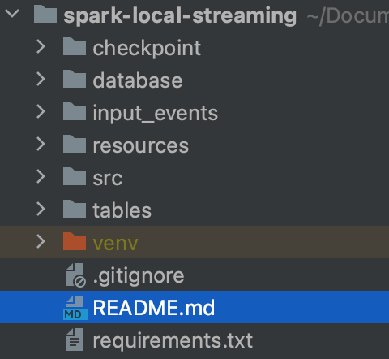
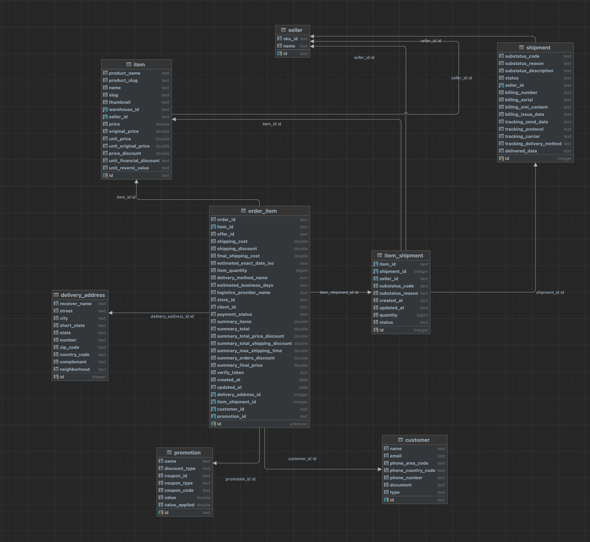

# Event Transforming and Streaming with Spark

This application is an example implementation of using Spark Stream to read nested JSON events and generate tables from them 
according to the model


## Built With

* [PySpark 3.5](https://spark.apache.org/docs/latest/api/python/index.html)


## Getting Started

To see the application running on your local environment follow the steps described

### Prerequisites

* Python 3.9

### Installing Dependencies

1. Create a virtual enviromnent
    ```sh
     python3.9 -m venv spark-env
    ```
2. Activate the virtual environment
    ```sh
     source spark-env/bin/activate
    ```
3. Install pyspark
    ```sh
    pip install pyspark==3.5.0
    ```
   
### Running Application

#### To note
 - The checkpoint folder is empty so the application will read all the files in the input_events and recreate the tables
 - If you want to see the application being trigger by a new file, simply have it running after it had read all current 
files in input_events folder and put a new file with the same base structure inside the folder

To start the application run:
    ```
    python src/main.py
    ```

## Project Structure


- **checkpoint/**: folder where SparkStreaming outputs checkpoints for fault-tolerance
- **database/**: scripts used to create database with SQLite, used just to better visualize the model built on top of the JSON events
- **input_events/**: sample event JSON files used in this project
- **../tables/**: directory containing all tables generated
- **../src/**: directory streaming application files
  - **main.py**: entrypoint for the application
  - **read.py**: Spark ReadStream definition
  - **table_transformer.py**: contains class definitions for each table created from the JSON
  - **transform.py**: Performs basic schema transformation and ordering of the events
  - **write.py**: builds tables from the events and outputs them on ../tables/ folder

## Modeling
The following modeling was followed to build the tables from the JSON event.

This model was built on the assumption that the consumers would be mostly interest on the Order Item status and information, for that reason
order_item is the central fact table on it

The DDLs are inside the database/ folder



## Projects improvements

Given more time to put on this project a few improvements points are:
- Enforce the relation between the output tables, there are a few IDs that need to be propagated properly on the Fact table. This was done for delivery_address_id
- Use Delta or any other merge supported technology to merge results instead of reading all the events and overwriting the output table every new batch
- Make it more config based. As of now settings are hard coded such as the batch duration, number of files, input.
- Add more exception handling and logging
- Configure to read from a S3 bucket or SQS queue
- Modularize better the table transformer and writer
- Add metadata to generated tables